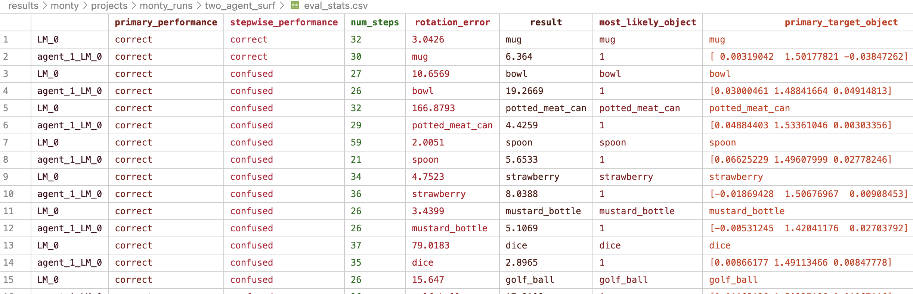

# Monty Lab

## 29Sep2025 - Understanding how to build meaningful notes using vs code org mode

\*\* Getting started with Org mode

- installed the extension
- Wrote my first notes
  - will try to use it more often
  - explore the documentation https://orgmode.org/org.html

## 5Oct2025 - Understanding the Thousand Brains Project

- the thousand brains project is an open-source framework for sensorimotor learning systems that follow the same principles of the human brain. Monty is the first implementation of the Thousand brains system.
- Monty was named in honor of Vernon Mountcastle, who argued that the power of the mammalian brain lies in its re-use of cortical columns as the primary computational unit, Monty represents a fundamentally new way of building AI systems.
- The ultimate aim of this to enable developers to build AI applications that are more intelligent, more flexible, and more capable than those built using traditional deep learning methods.

- Walk through the first tutorial.

## 19Jan2026 - Understanding Hydra configuration platform

- Monty team migraget the entire monty project to using Hydra for managing the configurations.

## 4 Feb2026 - Implementing Multi-Agent Communication using Monty

- following the same process discussed in the turorials.
- current framework has limitations as the habitat environment is designed to only allow one agent in the environment.

## 19Apr2026

- fixing the error when running `python run.py experiment=tutorial/first_experiment`

```
Error executing job with overrides: ['experiment=tutorial/first_experiment']
Traceback (most recent call last):
  File "/opt/anaconda3/envs/tbp.monty/lib/python3.8/site-packages/omegaconf/base.py", line 764, in resolve_parse_tree
    return visitor.visit(parse_tree)
  File "/opt/anaconda3/envs/tbp.monty/lib/python3.8/site-packages/antlr4/tree/Tree.py", line 34, in visit
    return tree.accept(self)
  File "/opt/anaconda3/envs/tbp.monty/lib/python3.8/site-packages/omegaconf/grammar/gen/OmegaConfGrammarParser.py", line 206, in accept
    return visitor.visitConfigValue(self)
  File "/opt/anaconda3/envs/tbp.monty/lib/python3.8/site-packages/omegaconf/grammar_visitor.py", line 101, in visitConfigValue
    return self.visit(ctx.getChild(0))
  File "/opt/anaconda3/envs/tbp.monty/lib/python3.8/site-packages/antlr4/tree/Tree.py", line 34, in visit
    return tree.accept(self)
  File "/opt/anaconda3/envs/tbp.monty/lib/python3.8/site-packages/omegaconf/grammar/gen/OmegaConfGrammarParser.py", line 342, in accept
    return visitor.visitText(self)
  File "/opt/anaconda3/envs/tbp.monty/lib/python3.8/site-packages/omegaconf/grammar_visitor.py", line 298, in visitText
    return self.visitInterpolation(c)
  File "/opt/anaconda3/envs/tbp.monty/lib/python3.8/site-packages/omegaconf/grammar_visitor.py", line 125, in visitInterpolation
    return self.visit(ctx.getChild(0))
  File "/opt/anaconda3/envs/tbp.monty/lib/python3.8/site-packages/antlr4/tree/Tree.py", line 34, in visit
    return tree.accept(self)
  File "/opt/anaconda3/envs/tbp.monty/lib/python3.8/site-packages/omegaconf/grammar/gen/OmegaConfGrammarParser.py", line 1041, in accept
    return visitor.visitInterpolationResolver(self)
  File "/opt/anaconda3/envs/tbp.monty/lib/python3.8/site-packages/omegaconf/grammar_visitor.py", line 179, in visitInterpolationResolver
    return self.resolver_interpolation_callback(
  File "/opt/anaconda3/envs/tbp.monty/lib/python3.8/site-packages/omegaconf/base.py", line 750, in resolver_interpolation_callback
    return self._evaluate_custom_resolver(
  File "/opt/anaconda3/envs/tbp.monty/lib/python3.8/site-packages/omegaconf/base.py", line 694, in _evaluate_custom_resolver
    return resolver(
  File "/opt/anaconda3/envs/tbp.monty/lib/python3.8/site-packages/omegaconf/omegaconf.py", line 445, in resolver_wrapper
    ret = resolver(*args, **kwargs)
  File "/Users/duaaali/tbp/tbp.monty/src/tbp/monty/hydra.py", line 29, in monty_class_resolver
    module_obj = importlib.import_module(module)
  File "/opt/anaconda3/envs/tbp.monty/lib/python3.8/importlib/__init__.py", line 127, in import_module
    return _bootstrap._gcd_import(name[level:], package, level)
  File "<frozen importlib._bootstrap>", line 1014, in _gcd_import
  File "<frozen importlib._bootstrap>", line 991, in _find_and_load
  File "<frozen importlib._bootstrap>", line 975, in _find_and_load_unlocked
  File "<frozen importlib._bootstrap>", line 671, in _load_unlocked
  File "<frozen importlib._bootstrap_external>", line 843, in exec_module
  File "<frozen importlib._bootstrap>", line 219, in _call_with_frames_removed
  File "/Users/duaaali/tbp/tbp.monty/src/tbp/monty/frameworks/environments/embodied_data.py", line 24, in <module>
    from tbp.monty.frameworks.environment_utils.transforms import (
  File "/Users/duaaali/tbp/tbp.monty/src/tbp/monty/frameworks/environment_utils/transforms.py", line 15, in <module>
    import cv2
ModuleNotFoundError: No module named 'cv2'

During handling of the above exception, another exception occurred:

Traceback (most recent call last):
  File "/Users/duaaali/tbp/tbp.monty/src/tbp/monty/frameworks/run.py", line 63, in main
    experiment = hydra.utils.instantiate(cfg.experiment)
  File "/opt/anaconda3/envs/tbp.monty/lib/python3.8/site-packages/hydra/_internal/instantiate/_instantiate2.py", line 220, in instantiate
    OmegaConf.resolve(config)
omegaconf.errors.InterpolationResolutionError: ModuleNotFoundError raised while resolving interpolation: No module named 'cv2'

Set the environment variable HYDRA_FULL_ERROR=1 for a complete stack trace.
```

~ solved by `
pip install opencv`

## 5MAY2026 - editing the code to fit multiagents

1- In src/tbp/monty/simulators/habitat/environment.py, there is a hardcoded limitation:

agents = [agents] # ← forces only 1 agent, despite HabitatSim supporting N
Fix: Change HabitatEnvironment.**init** to accept a list of AgentConfig objects:

`self._agents = [] #line 107`
2- Currently MontyExperiment holds one self.monty. The experiment calls:

env.reset() → monty.step(obs, prop_state) → env.step(actions) → repeat

need a new experiment class that holds two Monty instances and steps the

```
class MultiAgentMontyExperiment(MontyExperiment):
    def __init__(self, ..., monty_configs: list):
        self.monty_agents = [build_monty(cfg) for cfg in monty_configs]
        # env has two HabitatAgents registered

    def run_episode_steps(self):
        obs, prop_state = self.env.reset()
        while not all_done:
            all_actions = []
            for monty in self.monty_agents:
                # each Monty only sees its own agent's observations
                agent_obs = filter_obs(obs, monty.agent_id)
                agent_prop = filter_prop(prop_state, monty.agent_id)
                actions = monty.step(ctx, agent_obs, agent_prop)
                all_actions.extend(actions)

            # inter-agent communication step (Layer 3)
            self._communicate_between_agents()

            obs, prop_state = self.env.step(all_actions)
```

### Summary of What to Build

1. HabitatEnvironment ← remove the agents=[agents] line, accept list
2. MultiAgentMontyExperiment ← new experiment class, holds N Monty instances,
   steps them jointly, routes obs by agent_id
3. Monty subclass ← add send_agent_message() / receive_agent_message()
   with whatever communication content your model requires
4. YAML config ← two agent_configs, two monty_configs, one env

## Wandb

- API KEY: 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

## 12MAY2026 - Multi Agent Implementation of Monty

The goal is to support Theory of Mind research by allowing agents to perceive the same scene independently and eventually communicate with each other.

### Code Modifications

- edited the habitat environment to include more than one agent.
- file located at `src/tbp/monty/simulators/habitat/environment.py`
- code changes:

#### 1. The habitat

- edited the habitat environment to include more than one agent.
- file located at `src/tbp/monty/simulators/habitat/environment.py`
- code changes:

```
      agents: dict | AgentConfig, at the line 98 changed to agents: list[dict | AgentConfig],
```

```
      agents = [agents] # at line 107 ← forces only 1 agent, despite HabitatSim supporting N agents

        # changed to a list to support multiple agents
        self._agents = []
```

#### 2. MultiAgentMontyExperiment ← new experiment class, holds N Monty instances,

steps them jointly, routes obs by agent_id 3. Monty subclass ← add send_agent_message() / receive_agent_message()
with whatever communication content your model requires 4. YAML config ← two agent_configs, two monty_configs, one env

#### log for running two_agent_surf:

```
(tbp.monty) ➜ tbp.monty git:(main) ✗ python run.py experiment=two_agent_surf
MONTY_LOGS not set. Using default directory: /Users/duaaali/tbp/results/monty
MONTY_MODELS not set. Using default directory: /Users/duaaali/tbp/results/monty/pretrained_models
MONTY_DATA not set. Using default directory: /Users/duaaali/tbp/data
WANDB_DIR not set. Using default directory: /Users/duaaali/tbp/results/monty

## Printing config below

experiment:
config:
do*eval: true
do_train: false
eval_env_interface_args:
parent_to_child_mapping: null
object_names: - mug - bowl - potted_meat_can - spoon - strawberry - mustard_bottle - dice - golf_ball - c_lego_duplo - banana
object_init_sampler:
\_target*: tbp.monty.frameworks.environments.object*init_samplers.RandomRotation
eval_env_interface_class: ${monty.class:tbp.monty.experiment.environment.OneObjectPerEpisodeInterface}
    logging:
      monty_log_level: BASIC
      monty_handlers:
      - ${monty.class:tbp.monty.frameworks.loggers.monty_handlers.BasicCSVStatsHandler}
      wandb_handlers:
      - ${monty.class:tbp.monty.frameworks.loggers.wandb_handlers.BasicWandbTableStatsHandler}
      - ${monty.class:tbp.monty.frameworks.loggers.wandb_handlers.BasicWandbChartStatsHandler}
      python_log_level: WARNING
      python_log_to_file: true
      python_log_to_stderr: true
      output_dir: ${path.expanduser:${oc.env:MONTY_LOGS}/projects/monty_runs}
resume_wandb_run: false
wandb_id:
\_target*: wandb.util.generate*id
wandb_group: benchmark_experiments
run_name: two_agent_surf
show_sensor_output: false
max_train_steps: 1000
max_eval_steps: 500
max_total_steps: 5000
n_train_epochs: 3
n_eval_epochs: 10
min_lms_match: 1
seed: 42
supervised_lm_ids: []
model_name_or_path: null
environment:
env_init_func: ${monty.class:tbp.monty.simulators.habitat.environment.HabitatEnvironment}
      env_init_args:
        scene_id: null
        seed: 42
        data_path: ${path.expanduser:${oc.env:MONTY_DATA}/habitat/objects/ycb}
objects: - name: coneSolid
position: - 0.0 - 1.5 - -0.1
agents: - agent_type: ${monty.class:tbp.monty.simulators.habitat.MultiSensorAgent}
agent_args:
agent_id: agent_id_0
sensor_ids: - patch - view_finder
height: 0.0
position: - 0.0 - 1.5 - 0.1
resolutions: - - 64 - 64 - - 64 - 64
positions: - - 0.0 - 0.0 - 0.0 - - 0.0 - 0.0 - 0.03
rotations: - - 1.0 - 0.0 - 0.0 - 0.0 - - 1.0 - 0.0 - 0.0 - 0.0
semantics: - false - false
zooms: - 10.0 - 1.0
action_space_type: surface_agent - agent_type: ${monty.class:tbp.monty.simulators.habitat.MultiSensorAgent}
agent_args:
agent_id: agent_id_1
sensor_ids: - patch - view_finder
height: 0.0
position: - 0.3 - 1.5 - 0.1
resolutions: - - 64 - 64 - - 64 - 64
positions: - - 0.0 - 0.0 - 0.0 - - 0.0 - 0.0 - 0.03
rotations: - - 1.0 - 0.0 - 0.0 - 0.0 - - 1.0 - 0.0 - 0.0 - 0.0
semantics: - false - false
zooms: - 10.0 - 1.0
action_space_type: surface_agent
transform: - \_target*: tbp.monty.frameworks.environment*utils.transforms.MissingToMaxDepth
agent_id: agent_id_0
max_depth: 1 - \_target*: tbp.monty.frameworks.environment*utils.transforms.DepthTo3DLocations
agent_id: agent_id_0
sensor_ids: - patch - view_finder
resolutions: - - 64 - 64 - - 64 - 64
world_coord: true
zooms: - 10.0 - 1.0
get_all_points: true
use_semantic_sensor: false
depth_clip_sensors: - 0
clip_value: 0.05 - \_target*: tbp.monty.frameworks.environment*utils.transforms.MissingToMaxDepth
agent_id: agent_id_1
max_depth: 1 - \_target*: tbp.monty.frameworks.environment*utils.transforms.DepthTo3DLocations
agent_id: agent_id_1
sensor_ids: - patch - view_finder
resolutions: - - 64 - 64 - - 64 - 64
world_coord: true
zooms: - 10.0 - 1.0
get_all_points: true
use_semantic_sensor: false
depth_clip_sensors: - 0
clip_value: 0.05
agent_monty_configs: - model_name_or_path: ${constants.pretrained_dir}/surf_agent_1lm_10distinctobj/pretrained/
monty_config:
monty_class: ${monty.class:tbp.monty.frameworks.models.evidence_matching.model.MontyForEvidenceGraphMatching}
monty_args:
num_exploratory_steps: 1000
min_eval_steps: ${constants.min_eval_steps}
min_train_steps: 3
max_total_steps: 2500
sm_to_agent_dict:
patch: agent_id_0
view_finder: agent_id_0
sm_to_lm_matrix: - - 0
lm_to_lm_matrix: null
lm_to_lm_vote_matrix: null
sensor_module_configs:
sensor_module_0:
sensor_module_class: ${monty.class:tbp.monty.frameworks.models.sensor_modules.CameraSM}
sensor_module_args:
sensor_module_id: patch
features: - pose_vectors - pose_fully_defined - on_object - object_coverage - min_depth - mean_depth - hsv - principal_curvatures - principal_curvatures_log
save_raw_obs: false
delta_thresholds:
on_object: 0
distance: 0.01
is_surface_sm: true
noise_params:
features:
pose_vectors: 2
hsv: 0.1
principal_curvatures_log: 0.1
pose_fully_defined: 0.01
location: 0.002
sensor_module_1:
sensor_module_class: ${monty.class:tbp.monty.frameworks.models.sensor_modules.Probe}
sensor_module_args:
sensor_module_id: view_finder
save_raw_obs: true
learning_module_configs:
learning_module_0:
learning_module_class: ${monty.class:tbp.monty.frameworks.models.evidence_matching.learning_module.EvidenceGraphLM}
learning_module_args:
hypotheses_updater_class: ${monty.class:tbp.monty.frameworks.models.evidence_matching.burst_sampling.BurstSamplingHypothesesUpdater}
hypotheses_updater_args:
max_nneighbors: 10
feature_weights:
patch:
hsv: ${np.array:[1, 0.5, 0.5]}
pose_vectors: ${np.ones:3}
principal_curvatures_log: ${np.ones:2}
tolerances:
patch:
hsv: ${np.array:[0.1, 0.2, 0.2]}
principal_curvatures_log: ${np.ones:2}
max_match_distance: 0.01
x_percent_threshold: 20
evidence_threshold_config: all
max_graph_size: 0.3
num_model_voxels_per_dim: 100
gsg:
\_target*: tbp.monty.frameworks.models.goal*generation.EvidenceGoalGenerator
goal_tolerances:
location: 0.015
elapsed_steps_factor: 10
min_post_goal_success_steps: 5
x_percent_scale_factor: 0.75
desired_object_distance: 0.025
motor_system_config:
\_target*: tbp.monty.frameworks.models.motor*system.MotorSystem
policy_selector:
\_target*: tbp.monty.frameworks.models.motor*policy_selectors.SinglePolicySelector
policy:
\_target*: tbp.monty.frameworks.models.motor*policies.SurfacePolicyCurvatureInformed
action_sampler:
\_target*: tbp.monty.frameworks.actions.action*samplers.ConstantSampler
actions: - ${monty.class:tbp.monty.frameworks.actions.actions.MoveForward} - ${monty.class:tbp.monty.frameworks.actions.actions.MoveTangentially} - ${monty.class:tbp.monty.frameworks.actions.actions.OrientHorizontal} - ${monty.class:tbp.monty.frameworks.actions.actions.OrientVertical}
use_goal_driven_actions: true
agent_id: agent_id_0
desired_object_distance: 0.025
alpha: 0.1
pc_alpha: 0.5
max_pc_bias_steps: 32
min_general_steps: 8
min_heading_steps: 12 - model_name_or_path: ${constants.pretrained_dir}/surf_agent_1lm_10distinctobj/pretrained/
monty_config:
monty_class: ${monty.class:tbp.monty.frameworks.models.evidence_matching.model.MontyForEvidenceGraphMatching}
monty_args:
num_exploratory_steps: 1000
min_eval_steps: ${constants.min_eval_steps}
min_train_steps: 3
max_total_steps: 2500
sm_to_agent_dict:
patch: agent_id_1
view_finder: agent_id_1
sm_to_lm_matrix: - - 0
lm_to_lm_matrix: null
lm_to_lm_vote_matrix: null
sensor_module_configs:
sensor_module_0:
sensor_module_class: ${monty.class:tbp.monty.frameworks.models.sensor_modules.CameraSM}
sensor_module_args:
sensor_module_id: patch
features: - pose_vectors - pose_fully_defined - on_object - object_coverage - min_depth - mean_depth - hsv - principal_curvatures - principal_curvatures_log
save_raw_obs: false
delta_thresholds:
on_object: 0
distance: 0.01
is_surface_sm: true
noise_params:
features:
pose_vectors: 2
hsv: 0.1
principal_curvatures_log: 0.1
pose_fully_defined: 0.01
location: 0.002
sensor_module_1:
sensor_module_class: ${monty.class:tbp.monty.frameworks.models.sensor_modules.Probe}
sensor_module_args:
sensor_module_id: view_finder
save_raw_obs: true
learning_module_configs:
learning_module_0:
learning_module_class: ${monty.class:tbp.monty.frameworks.models.evidence_matching.learning_module.EvidenceGraphLM}
learning_module_args:
hypotheses_updater_class: ${monty.class:tbp.monty.frameworks.models.evidence_matching.burst_sampling.BurstSamplingHypothesesUpdater}
hypotheses_updater_args:
max_nneighbors: 10
feature_weights:
patch:
hsv: ${np.array:[1, 0.5, 0.5]}
pose_vectors: ${np.ones:3}
principal_curvatures_log: ${np.ones:2}
tolerances:
patch:
hsv: ${np.array:[0.1, 0.2, 0.2]}
principal_curvatures_log: ${np.ones:2}
max_match_distance: 0.01
x_percent_threshold: 20
evidence_threshold_config: all
max_graph_size: 0.3
num_model_voxels_per_dim: 100
gsg:
\_target*: tbp.monty.frameworks.models.goal*generation.EvidenceGoalGenerator
goal_tolerances:
location: 0.015
elapsed_steps_factor: 10
min_post_goal_success_steps: 5
x_percent_scale_factor: 0.75
desired_object_distance: 0.025
motor_system_config:
\_target*: tbp.monty.frameworks.models.motor*system.MotorSystem
policy_selector:
\_target*: tbp.monty.frameworks.models.motor*policy_selectors.SinglePolicySelector
policy:
\_target*: tbp.monty.frameworks.models.motor*policies.SurfacePolicyCurvatureInformed
action_sampler:
\_target*: tbp.monty.frameworks.actions.action*samplers.ConstantSampler
actions: - ${monty.class:tbp.monty.frameworks.actions.actions.MoveForward} - ${monty.class:tbp.monty.frameworks.actions.actions.MoveTangentially} - ${monty.class:tbp.monty.frameworks.actions.actions.OrientHorizontal} - ${monty.class:tbp.monty.frameworks.actions.actions.OrientVertical}
use_goal_driven_actions: true
agent_id: agent_id_1
desired_object_distance: 0.025
alpha: 0.1
pc_alpha: 0.5
max_pc_bias_steps: 32
min_general_steps: 8
min_heading_steps: 12
\_target*: tbp.monty.frameworks.experiments.multi_agent_experiment.MultiAgentMontyExperiment
episodes: all
num_parallel: 16
print_cfg: false
quiet_habitat_logs: true
constants:
default_all_noise_params:
features:
pose_vectors: 2
hsv: 0.1
principal_curvatures_log: 0.1
pose_fully_defined: 0.01
location: 0.002
default_sensor_features:

- pose_vectors
- pose_fully_defined
- on_object
- hsv
- principal_curvatures_log
  min_eval_steps: 20
  pretrained_dir: ${path.expanduser:${oc.env:MONTY_MODELS}/pretrained_ycb_v12}
  compositional_pretrained_dir: ${path.expanduser:${oc.env:MONTY_MODELS}/pretrained_compositional_objects_v3}
  rotations_all_count: 14
  rotations_all:
- - 0
  - 0
  - 0
- - 0
  - 90
  - 0
- - 0
  - 180
  - 0
- - 0
  - 270
  - 0
- - 90
  - 0
  - 0
- - 90
  - 180
  - 0
- - 35
  - 45
  - 0
- - 325
  - 45
  - 0
- - 35
  - 315
  - 0
- - 325
  - 315
  - 0
- - 35
  - 135
  - 0
- - 325
  - 135
  - 0
- - 35
  - 225
  - 0
- - 325
    - 225
    - 0
      rotations_3_count: 3
      rotations_3:
- - 0
  - 0
  - 0
- - 0
  - 90
  - 0
- - 0
  - 180
  - 0

---

wandb: [wandb.login()] Loaded credentials for https://api.wandb.ai from /Users/duaaali/.netrc.
wandb: Currently logged in as: duaaali (duaaali-monty) to https://api.wandb.ai. Use `wandb login --relogin` to force relogin
wandb: Tracking run with wandb version 0.24.2
wandb: Run data is saved locally in /Users/duaaali/tbp/results/monty/wandb/run-20260512_084448-oryyl4c1
wandb: Run `wandb offline` to turn off syncing.
wandb: Syncing run two_agent_surf_oryyl4c1
wandb: ⭐️ View project at https://wandb.ai/duaaali-monty/Monty
wandb: 🚀 View run at https://wandb.ai/duaaali-monty/Monty/runs/oryyl4c1
WARNING:tbp.monty.frameworks.utils.logging_utils:maybe_rename_existing_file:1018:Output file eval_stats.csv already exists. This file will be moved to eval_stats_old.csv
WARNING:tbp.monty.frameworks.utils.logging_utils:maybe_rename_existing_file:1024:Output file /Users/duaaali/tbp/results/monty/projects/monty_runs/two_agent_surf/eval_stats_old.csv also already exists. This file will be removed before renaming.
wandb:
wandb: Run history:
wandb: LM_0/episode/avg_prediction_error ▄█▆▃▆▂▄▅▅▅▄▂▂▅▄▆▁█▃▅▁▃▆▄▅▃▃▆▄▄▂▆▇▅▁▄▁▆▄▇
wandb: LM_0/episode/individual_ts_rotation_error ▃▂▅▂▁█▂▂▂▃▂▃▂▂▁▃▁▁▂▂▃▂▂▁▂▁▂▃▃▁▄▁▂▂▁▁▂▁▂▁
wandb: LM_0/episode/steps_to_individual_ts ▁▂▂▁▂▁▄▂▂▂▂▂▂▂▁▆▄▁▄▂▂▅▂▂▂▂▂█▂▁▂▁▂▁▂▁▅▃▄▂
wandb: agent_1/LM_0/episode/avg_prediction_error ▃▃▂▄▃▄▆▅▃▄▄▃▅▅▅▄▁▆▄▄▄▂▆▅▃▅▃▃▃▂▅▃▃▄▅▂▅▂▁█
wandb: agent_1/LM_0/episode/individual_ts_rotation_error ▁▁▂▁▁▁▁▁▁▁▂▁▁█▁▁▁▁▂▁▁▁▁▁▁▁▁▁▁▁▁▁▁▁▂▁▁▁▂▁
wandb: agent_1/LM_0/episode/steps_to_individual_ts ▃▂▃▁▂▃▂▆▂▃▁▄▂▁▃▁▆▃▁▂▂█▂▅▂▄▂▃▂▃▁▃▄▄▁▂▂▁▃▁
wandb: episode/confused ▁▁▁▁▁▁▁▁▁▁▁▁▁▁▁▁▁▁▁▁▁▁▁▁▁▁▁▁▁▁▁▁▁▁▁▁▁▁▁▁
wandb: episode/confused_mlh ▁▁▁▁▁▁▁▁▁▁▁▁▁▁▁▁▁▁▁▁▁▁▁▁▁▁▁▁▁▁▁▁▁▁▁▁▁▁▁▁
wandb: episode/consistent_child_obj ▁▁▁▁▁▁▁▁▁▁▁▁▁▁▁▁▁▁▁▁▁▁▁▁▁▁▁▁▁▁▁▁▁▁▁▁▁▁▁▁
wandb: episode/consistent_child_or_parent ▁▁▁▁▁▁▁▁▁▁▁▁▁▁▁▁▁▁▁▁▁▁▁▁▁▁▁▁▁▁▁▁▁▁▁▁▁▁▁▁
wandb: +41 ...
wandb:
wandb: Run summary:
wandb: LM_0/episode/avg_prediction_error 0.33903
wandb: LM_0/episode/individual_ts_rotation_error 4.5414
wandb: LM_0/episode/steps_to_individual_ts 26
wandb: agent_1/LM_0/episode/avg_prediction_error 0.30864
wandb: agent_1/LM_0/episode/individual_ts_rotation_error 2.4368
wandb: agent_1/LM_0/episode/primary_performance correct
wandb: agent_1/LM_0/episode/steps_to_individual_ts 21
wandb: episode/confused 0
wandb: episode/confused_mlh 0
wandb: episode/consistent_child_obj 0
wandb: +42 ...
wandb:
wandb: 🚀 View run two_agent_surf_oryyl4c1 at: https://wandb.ai/duaaali-monty/Monty/runs/oryyl4c1
wandb: ⭐️ View project at: https://wandb.ai/duaaali-monty/Monty
wandb: Synced 5 W&B file(s), 100 media file(s), 200 artifact file(s) and 0 other file(s)
wandb: Find logs at: /Users/duaaali/tbp/results/monty/wandb/run-20260512_084448-oryyl4c1/logs
```

#### \* Strugles encountered after running the experiment

- the logging setting was set to only one agent, so the output of the rest of the agents was not logged.
- Solution:
  Two changes were made, both only in `multi_agent_experiment.py`:

1. \_log_extra_agents_buffered() — fixes WandB charts

- Added a new method that calls get_stats_per_lm on agents 1+ and buffers their metrics into WandB using commit=False before the main logger commits, so all agents land on the same WandB step:

```
def _log_extra_agents_buffered(self) -> None:
    ...
    for agent_idx in range(1, len(self.monty_agents)):
        stats = get_stats_per_lm(agent, target, seed)
        metrics[f"agent_{agent_idx}/{lm_key}/episode/..."] = lm_stats.get(...)

    wandb.log(metrics, step=episode, commit=False)
```

- Called at the top of post_episode, before self.logger_handler.post_episode() triggers the final commit.

2. \_write_extra_agents_to_csv() — fixes the CSV
   Added a method that builds a dataframe from agents 1+ stats and appends it to the same eval_stats.csv file that the parent logger just wrote agent 0's row to:

```
def _write_extra_agents_to_csv(self) -> None:
...
for agent_idx in range(1, len(self.monty_agents)):
stats = get_stats_per_lm(agent, target, seed)
rows = {f"agent_{agent*idx}*{lm_key}": lm_stats ...}
df = pd.DataFrame.from_dict(rows, orient="index")
df.to_csv(csv_path, mode="a", header=False)
```

- Called at the bottom of post_episode, after the parent logger has already written agent 0's row.
- Error: the data looked misaligned starting from the "rotation error" column for agent 1  The issue is column ordering. When I write agent 1's dataframe with to_csv, pandas writes columns in whatever order the dict happens to have — which doesn't match the column order agent 0's logger established in the CSV. The values then land in the wrong columns.

- Fix: read the existing CSV header first and reindex agent 1's dataframe to match before appending.

```
def _write_extra_agents_to_csv(self) -> None:
    if not hasattr(self, "monty_agents") or len(self.monty_agents) <= 1:
        return
    target = getattr(self.env_interface, "primary_target", None)
    if target is None:
        return
    seed = self._rng_seed_history[-1] if self._rng_seed_history else self.config["seed"]
    mode = self.experiment_mode
    csv_path = self.output_dir / f"{mode}_stats.csv"

    for agent_idx in range(1, len(self.monty_agents)):
        agent = self.monty_agents[agent_idx]
        try:
            stats = get_stats_per_lm(agent, target, seed)
        except Exception:
            continue

        rows = {}
        for lm_key, lm_stats in stats.items():
            if lm_key.startswith("LM_"):
                row_key = f"agent_{agent_idx}_{lm_key}"
                rows[row_key] = lm_stats

        if not rows:
            continue

        df = pd.DataFrame.from_dict(rows, orient="index")
        df["lm_id"] = df.index

        # Reorder columns to match the existing CSV
        if csv_path.exists():
            existing_cols = pd.read_csv(csv_path, nrows=0, index_col=0).columns.tolist()
            df = df.reindex(columns=existing_cols)

        header = not csv_path.exists()
        df.to_csv(csv_path, mode="a", header=header)
```


- Two imports added at the top of the file:

```
import pandas as pd
from tbp.monty.frameworks.utils.logging_utils import get_stats_per_lm
```

### files impacted:

- habitat_ycb_two_agents.yaml at `/src/tbp/monty/conf/environment`
- multi_agent_experiment.py at `/src/tbp/monty/src/tbp/monty/frameworks/experiments`
- two_agent_surf.py at `/src/tbp/monty/src/tbp/monty/experiments`

## 18May2026 - Mutli Agent Implementation (Cont.)

### Making the logging of the experiment's run DETAILED.

Going through the TBP logging and analysis documentation (https://thousandbrainsproject.readme.io/docs/logging-and-analysis)

- logging for any experiment is handled through the logging config
- The logging config has two fields for handlers, `monty_handlers` and `wandb_handlers`
- The latter will start a wandb session if it does not contain an empty list. The former can contain all other non-wandb handlers.

* changed logging - under defaults - to detailed_debug_monty_runs in two_agent_surf.py to:

`- /logging: detailed_debug_monty_runs`

instead of - /logging: basic_info_monty_runs

## 2Jun2026 - Understanding the habitat

- In Habitat-sim, positions are [x, y, z] in meters:
  - x = left/right (negative = left, positive = right)
  - y = up/down (height)
  - z = forward/back (negative = forward into scene, positive = toward camera/behind)

- in the two agents experiment setup:
  Object at [0.0, 1.5, -0.1] → centered, 1.5m high, slightly forward
  agent_id_0 at [0.0, 1.5, 0.1] → same x/y as object, 0.2m behind it (z = 0.1 vs -0.1)
  agent_id_1 at [0.3, 1.5, 0.1] → 0.3m to the right of agent_0, same height and depth

The proposed fix [0.0, 1.5, 0.3] would place agent_1 directly behind agent_0 (further back on z-axis), approaching the object from the same direction but farther away — which is not ideal either since both agents would be on the same axis.

A better option: [-0.3, 1.5, 0.1] — mirrors agent_0's x-offset to the left side instead of right. Both agents approach from the front, symmetric around the object's center.

Yes, they're world coordinates in the Habitat-sim scene — an absolute position in 3D space, in meters, relative to the scene's origin point [0, 0, 0].

Think of it like a room:

The scene has a fixed origin somewhere in the virtual space
Every object and agent is placed at an absolute [x, y, z] position within that room
y = 1.5 means 1.5 meters off the ground (roughly table height)
The object and agents all share y = 1.5, so they're all at the same height — the agent's sensor is level with the object

The agents don't have their own local coordinate systems for placement — it's all one shared world space. When the simulation starts, Habitat places everything at those absolute coordinates and the agents begin exploring from there.

The sensor positions are relative to the agent's own position — they're local offsets from the agent's body.

So if an agent is at [0.0, 1.5, 0.2] and its sensor has position [0.0, 0.0, 0.0], the sensor ends up at [0.0, 1.5, 0.2] in world space. If the sensor had offset [0.0, 0.1, 0.0], it would be at [0.0, 1.6, 0.2].

### Analyzing Data From monty_handlers

The plot_utils.py contains utils for plotting the logged data. The logging_utils.py file contains some useful utils for loading logs and printing some summary statistics on them.

- Installed the analysis optional dependencies to use plot_utils.py `pip install -e .'[analysis]'`

### from LM-to-LM inside a single Monty to Monty-to-Monty across agents.

- this phase will be postponed for now.

## 2026Jun14 - Running the multi agents simulation with multiple LMs

1-

## 2026Aug10 - code review for the multi agent version of monty

- ran `pytest` and got the following error message:

```____________________________________________ HabitatDataTest.test_env_interface_abs_states ____________________________________________
[gw7] darwin -- Python 3.8.20 /opt/anaconda3/envs/tbp.monty/bin/python

self = <tests.unit.frameworks.environments.habitat_data_test.HabitatDataTest testMethod=test_env_interface_abs_states>
mock_simulator_class = <MagicMock name='Simulator' spec='Simulator' id='6797272976'>
mock_agent_class = <MagicMock name='Agent' spec='Agent' id='6797653904'>

    @mock.patch("habitat_sim.Agent", autospec=True)
    @mock.patch("habitat_sim.Simulator", autospec=True)
    def test_env_interface_abs_states(
        self,
        mock_simulator_class: mock.MagicMock,
        mock_agent_class: mock.MagicMock,
    ):
        # Mock habitat_sim classes
        mock_agent_abs = mock_agent_class.return_value
        mock_agent_abs.agent_config = self.camera_abs.get_spec()
        mock_agent_abs.scene_node = mock.Mock(
            translation=mn.Vector3.zero_init(),
            rotation=mn.Quaternion.zero_init(),
            node_sensors={},
        )
        mock_sim_abs = mock_simulator_class.return_value
        mock_sim_abs.agents = [mock_agent_abs]
        mock_sim_abs.get_agent.side_effect = lambda agent_idx: (
            mock_agent_abs if agent_idx == 0 else None
        )
        mock_sim_abs.reset.return_value = self.mock_reset
        mock_sim_abs.get_sensor_observations.side_effect = self.mock_observations

        seed = 42
        rng = np.random.RandomState(seed)

        env_init_args = {"agents": self.camera_abs_config}
>       env = HabitatEnvironment(**env_init_args)

tests/unit/frameworks/environments/habitat_data_test.py:310:
_ _ _ _ _ _ _ _ _ _ _ _ _ _ _ _ _ _ _ _ _ _ _ _ _ _ _ _ _ _ _ _ _ _ _ _ _ _ _ _ _ _ _ _ _ _ _ _ _ _ _ _ _ _ _ _ _ _ _ _ _ _ _ _ _ _ _ _

self = <tbp.monty.simulators.habitat.environment.HabitatEnvironment object at 0x1952c7a30>
agents = AgentConfig(agent_type=<class 'tbp.monty.simulators.habitat.agents.SingleSensorAgent'>, agent_args={'agent_id': 'camera', 'sensor_id': 'sensor_id_0', 'action_space_type': 'absolute_only'})
objects = None, scene_id = None, seed = 42, data_path = None

    def __init__(
        self,
        # agents: dict | AgentConfig,
        agents: list[dict | AgentConfig],
        objects: list[dict | ObjectConfig] | None = None,
        scene_id: str | None = None,
        seed: int = 42,
        data_path: str | Path | None = None,
    ):
        super().__init__()
        # # TODO: Change the configuration to configure multiple agents
        # agents = [agents]
        self._agents = []   # changed to a list to support multiple agents

>       for config in agents:
E       TypeError: 'AgentConfig' object is not iterable

src/tbp/monty/simulators/habitat/environment.py:110: TypeError
_______________________________________________ HabitatDataTest.test_env_interface_dist _______________________________________________
[gw7] darwin -- Python 3.8.20 /opt/anaconda3/envs/tbp.monty/bin/python

self = <tests.unit.frameworks.environments.habitat_data_test.HabitatDataTest testMethod=test_env_interface_dist>
mock_simulator_class = <MagicMock name='Simulator' spec='Simulator' id='6797215872'>
mock_agent_class = <MagicMock name='Agent' spec='Agent' id='6797956432'>

    @mock.patch("habitat_sim.Agent", autospec=True)
    @mock.patch("habitat_sim.Simulator", autospec=True)
    def test_env_interface_dist(
        self,
        mock_simulator_class: mock.MagicMock,
        mock_agent_class: mock.MagicMock,
    ):
        # Mock habitat_sim classes
        mock_agent_dist = mock_agent_class.return_value
        mock_agent_dist.agent_config = self.camera_dist.get_spec()
        mock_agent_dist.scene_node = mock.Mock(
            translation=mn.Vector3.zero_init(),
            rotation=mn.Quaternion.zero_init(),
            node_sensors={},
        )
        mock_sim_dist = mock_simulator_class.return_value
        mock_sim_dist.agents = [mock_agent_dist]
        mock_sim_dist.get_agent.side_effect = lambda agent_idx: (
            mock_agent_dist if agent_idx == 0 else None
        )
        mock_sim_dist.reset.return_value = self.mock_reset

        seed = 42
        rng = np.random.RandomState(seed)

        # Create habitat env datasets with distant-agent action space
        env_init_args = {"agents": self.camera_dist_config}
>       env = HabitatEnvironment(**env_init_args)

tests/unit/frameworks/environments/habitat_data_test.py:99:
_ _ _ _ _ _ _ _ _ _ _ _ _ _ _ _ _ _ _ _ _ _ _ _ _ _ _ _ _ _ _ _ _ _ _ _ _ _ _ _ _ _ _ _ _ _ _ _ _ _ _ _ _ _ _ _ _ _ _ _ _ _ _ _ _ _ _ _

self = <tbp.monty.simulators.habitat.environment.HabitatEnvironment object at 0x195316f10>
agents = AgentConfig(agent_type=<class 'tbp.monty.simulators.habitat.agents.SingleSensorAgent'>, agent_args={'agent_id': 'camera', 'sensor_id': 'sensor_id_0'})
objects = None, scene_id = None, seed = 42, data_path = None

    def __init__(
        self,
        # agents: dict | AgentConfig,
        agents: list[dict | AgentConfig],
        objects: list[dict | ObjectConfig] | None = None,
        scene_id: str | None = None,
        seed: int = 42,
        data_path: str | Path | None = None,
    ):
        super().__init__()
        # # TODO: Change the configuration to configure multiple agents
        # agents = [agents]
        self._agents = []   # changed to a list to support multiple agents

>       for config in agents:
E       TypeError: 'AgentConfig' object is not iterable

src/tbp/monty/simulators/habitat/environment.py:110: TypeError
___________________________________________ HabitatDataTest.test_env_interface_dist_states ____________________________________________
[gw7] darwin -- Python 3.8.20 /opt/anaconda3/envs/tbp.monty/bin/python

self = <tests.unit.frameworks.environments.habitat_data_test.HabitatDataTest testMethod=test_env_interface_dist_states>
mock_simulator_class = <MagicMock name='Simulator' spec='Simulator' id='6798072368'>
mock_agent_class = <MagicMock name='Agent' spec='Agent' id='6798263488'>

    @mock.patch("habitat_sim.Agent", autospec=True)
    @mock.patch("habitat_sim.Simulator", autospec=True)
    def test_env_interface_dist_states(
        self,
        mock_simulator_class: mock.MagicMock,
        mock_agent_class: mock.MagicMock,
    ):
        # Mock habitat_sim classes
        mock_agent_dist = mock_agent_class.return_value
        mock_agent_dist.agent_config = self.camera_dist.get_spec()
        mock_agent_dist.scene_node = mock.Mock(
            translation=mn.Vector3.zero_init(),
            rotation=mn.Quaternion.zero_init(),
            node_sensors={},
        )
        mock_sim_dist = mock_simulator_class.return_value
        mock_sim_dist.agents = [mock_agent_dist]
        mock_sim_dist.get_agent.side_effect = lambda agent_idx: (
            mock_agent_dist if agent_idx == 0 else None
        )
        mock_sim_dist.reset.return_value = self.mock_reset
        mock_sim_dist.get_sensor_observations.side_effect = self.mock_observations

        seed = 42
        rng = np.random.RandomState(seed)

        env_init_args = {"agents": self.camera_dist_config}
>       env = HabitatEnvironment(**env_init_args)

tests/unit/frameworks/environments/habitat_data_test.py:264:
_ _ _ _ _ _ _ _ _ _ _ _ _ _ _ _ _ _ _ _ _ _ _ _ _ _ _ _ _ _ _ _ _ _ _ _ _ _ _ _ _ _ _ _ _ _ _ _ _ _ _ _ _ _ _ _ _ _ _ _ _ _ _ _ _ _ _ _

self = <tbp.monty.simulators.habitat.environment.HabitatEnvironment object at 0x195364310>
agents = AgentConfig(agent_type=<class 'tbp.monty.simulators.habitat.agents.SingleSensorAgent'>, agent_args={'agent_id': 'camera', 'sensor_id': 'sensor_id_0'})
objects = None, scene_id = None, seed = 42, data_path = None

    def __init__(
        self,
        # agents: dict | AgentConfig,
        agents: list[dict | AgentConfig],
        objects: list[dict | ObjectConfig] | None = None,
        scene_id: str | None = None,
        seed: int = 42,
        data_path: str | Path | None = None,
    ):
        super().__init__()
        # # TODO: Change the configuration to configure multiple agents
        # agents = [agents]
        self._agents = []   # changed to a list to support multiple agents

>       for config in agents:
E       TypeError: 'AgentConfig' object is not iterable

src/tbp/monty/simulators/habitat/environment.py:110: TypeError
_______________________________________________ HabitatDataTest.test_env_interface_surf _______________________________________________
[gw7] darwin -- Python 3.8.20 /opt/anaconda3/envs/tbp.monty/bin/python

self = <tests.unit.frameworks.environments.habitat_data_test.HabitatDataTest testMethod=test_env_interface_surf>
mock_simulator_class = <MagicMock name='Simulator' spec='Simulator' id='6798350368'>
mock_agent_class = <MagicMock name='Agent' spec='Agent' id='6798148656'>

    @mock.patch("habitat_sim.Agent", autospec=True)
    @mock.patch("habitat_sim.Simulator", autospec=True)
    def test_env_interface_surf(
        self,
        mock_simulator_class: mock.MagicMock,
        mock_agent_class: mock.MagicMock,
    ):
        # Mock habitat_sim classes
        mock_agent_surf = mock_agent_class.return_value
        mock_agent_surf.agent_config = self.camera_surf.get_spec()
        mock_agent_surf.scene_node = mock.Mock(
            translation=mn.Vector3.zero_init(),
            rotation=mn.Quaternion.zero_init(),
            node_sensors={},
        )
        mock_sim_surf = mock_simulator_class.return_value
        mock_sim_surf.agents = [mock_agent_surf]
        mock_sim_surf.get_agent.side_effect = lambda agent_idx: (
            mock_agent_surf if agent_idx == 0 else None
        )
        mock_sim_surf.reset.return_value = self.mock_reset

        seed = 42
        rng = np.random.RandomState(seed)

        # Create habitat env interface with distant-agent action space
        env_init_args = {"agents": self.camera_surf_config}
>       env = HabitatEnvironment(**env_init_args)

tests/unit/frameworks/environments/habitat_data_test.py:209:
_ _ _ _ _ _ _ _ _ _ _ _ _ _ _ _ _ _ _ _ _ _ _ _ _ _ _ _ _ _ _ _ _ _ _ _ _ _ _ _ _ _ _ _ _ _ _ _ _ _ _ _ _ _ _ _ _ _ _ _ _ _ _ _ _ _ _ _

self = <tbp.monty.simulators.habitat.environment.HabitatEnvironment object at 0x195347e50>
agents = AgentConfig(agent_type=<class 'tbp.monty.simulators.habitat.agents.SingleSensorAgent'>, agent_args={'agent_id': 'camera', 'sensor_id': 'sensor_id_0', 'action_space_type': 'surface_agent'})
objects = None, scene_id = None, seed = 42, data_path = None

    def __init__(
        self,
        # agents: dict | AgentConfig,
        agents: list[dict | AgentConfig],
        objects: list[dict | ObjectConfig] | None = None,
        scene_id: str | None = None,
        seed: int = 42,
        data_path: str | Path | None = None,
    ):
        super().__init__()
        # # TODO: Change the configuration to configure multiple agents
        # agents = [agents]
        self._agents = []   # changed to a list to support multiple agents

>       for config in agents:
E       TypeError: 'AgentConfig' object is not iterable

src/tbp/monty/simulators/habitat/environment.py:110: TypeError
___________________________________________ HabitatDataTest.test_env_interface_surf_states ____________________________________________
[gw7] darwin -- Python 3.8.20 /opt/anaconda3/envs/tbp.monty/bin/python

self = <tests.unit.frameworks.environments.habitat_data_test.HabitatDataTest testMethod=test_env_interface_surf_states>
mock_simulator_class = <MagicMock name='Simulator' spec='Simulator' id='6798329648'>
mock_agent_class = <MagicMock name='Agent' spec='Agent' id='6798141424'>

    @mock.patch("habitat_sim.Agent", autospec=True)
    @mock.patch("habitat_sim.Simulator", autospec=True)
    def test_env_interface_surf_states(
        self,
        mock_simulator_class: mock.MagicMock,
        mock_agent_class: mock.MagicMock,
    ):
        # Mock habitat_sim classes
        mock_agent_surf = mock_agent_class.return_value
        mock_agent_surf.agent_config = self.camera_surf.get_spec()
        mock_agent_surf.scene_node = mock.Mock(
            translation=mn.Vector3.zero_init(),
            rotation=mn.Quaternion.zero_init(),
            node_sensors={},
        )
        mock_sim_surf = mock_simulator_class.return_value
        mock_sim_surf.agents = [mock_agent_surf]
        mock_sim_surf.get_agent.side_effect = lambda agent_idx: (
            mock_agent_surf if agent_idx == 0 else None
        )
        mock_sim_surf.reset.return_value = self.mock_reset
        mock_sim_surf.get_sensor_observations.side_effect = self.mock_observations

        seed = 42
        rng = np.random.RandomState(seed)

        env_init_args = {"agents": self.camera_surf_config}
>       env = HabitatEnvironment(**env_init_args)

tests/unit/frameworks/environments/habitat_data_test.py:355:
_ _ _ _ _ _ _ _ _ _ _ _ _ _ _ _ _ _ _ _ _ _ _ _ _ _ _ _ _ _ _ _ _ _ _ _ _ _ _ _ _ _ _ _ _ _ _ _ _ _ _ _ _ _ _ _ _ _ _ _ _ _ _ _ _ _ _ _

self = <tbp.monty.simulators.habitat.environment.HabitatEnvironment object at 0x19535a8e0>
agents = AgentConfig(agent_type=<class 'tbp.monty.simulators.habitat.agents.SingleSensorAgent'>, agent_args={'agent_id': 'camera', 'sensor_id': 'sensor_id_0', 'action_space_type': 'surface_agent'})
objects = None, scene_id = None, seed = 42, data_path = None

    def __init__(
        self,
        # agents: dict | AgentConfig,
        agents: list[dict | AgentConfig],
        objects: list[dict | ObjectConfig] | None = None,
        scene_id: str | None = None,
        seed: int = 42,
        data_path: str | Path | None = None,
    ):
        super().__init__()
        # # TODO: Change the configuration to configure multiple agents
        # agents = [agents]
        self._agents = []   # changed to a list to support multiple agents

>       for config in agents:
E       TypeError: 'AgentConfig' object is not iterable

src/tbp/monty/simulators/habitat/environment.py:110: TypeError
_______________________________________________ HabitatDataTest.test_env_interface_abs ________________________________________________
[gw4] darwin -- Python 3.8.20 /opt/anaconda3/envs/tbp.monty/bin/python

self = <tests.unit.frameworks.environments.habitat_data_test.HabitatDataTest testMethod=test_env_interface_abs>
mock_simulator_class = <MagicMock name='Simulator' spec='Simulator' id='6820549632'>
mock_agent_class = <MagicMock name='Agent' spec='Agent' id='6820907424'>

    @mock.patch("habitat_sim.Agent", autospec=True)
    @mock.patch("habitat_sim.Simulator", autospec=True)
    def test_env_interface_abs(
        self,
        mock_simulator_class: mock.MagicMock,
        mock_agent_class: mock.MagicMock,
    ):
        # Mock habitat_sim classes
        mock_agent_abs = mock_agent_class.return_value
        mock_agent_abs.agent_config = self.camera_abs.get_spec()
        mock_agent_abs.scene_node = mock.Mock(
            translation=mn.Vector3.zero_init(),
            rotation=mn.Quaternion.zero_init(),
            node_sensors={},
        )
        mock_sim_abs = mock_simulator_class.return_value
        mock_sim_abs.agents = [mock_agent_abs]
        mock_sim_abs.get_agent.side_effect = lambda agent_idx: (
            mock_agent_abs if agent_idx == 0 else None
        )
        mock_sim_abs.reset.return_value = self.mock_reset

        seed = 42
        rng = np.random.RandomState(seed)

        # Create habitat env with absolute action space
        env_init_args = {"agents": self.camera_abs_config}
>       env = HabitatEnvironment(**env_init_args)

tests/unit/frameworks/environments/habitat_data_test.py:154:
_ _ _ _ _ _ _ _ _ _ _ _ _ _ _ _ _ _ _ _ _ _ _ _ _ _ _ _ _ _ _ _ _ _ _ _ _ _ _ _ _ _ _ _ _ _ _ _ _ _ _ _ _ _ _ _ _ _ _ _ _ _ _ _ _ _ _ _

self = <tbp.monty.simulators.habitat.environment.HabitatEnvironment object at 0x1968f83a0>
agents = AgentConfig(agent_type=<class 'tbp.monty.simulators.habitat.agents.SingleSensorAgent'>, agent_args={'agent_id': 'camera', 'sensor_id': 'sensor_id_0', 'action_space_type': 'absolute_only'})
objects = None, scene_id = None, seed = 42, data_path = None

    def __init__(
        self,
        # agents: dict | AgentConfig,
        agents: list[dict | AgentConfig],
        objects: list[dict | ObjectConfig] | None = None,
        scene_id: str | None = None,
        seed: int = 42,
        data_path: str | Path | None = None,
    ):
        super().__init__()
        # # TODO: Change the configuration to configure multiple agents
        # agents = [agents]
        self._agents = []   # changed to a list to support multiple agents

>       for config in agents:
E       TypeError: 'AgentConfig' object is not iterable

src/tbp/monty/simulators/habitat/environment.py:110: TypeError
======================================================= short test summary info =======================================================
SKIPPED [1] tests/unit/simulators/mujoco/__init__.py:14: MuJoCo optional dependency not installed.
FAILED tests/unit/frameworks/environments/habitat_data_test.py::HabitatDataTest::test_env_interface_abs_states - TypeError: 'AgentCo...
FAILED tests/unit/frameworks/environments/habitat_data_test.py::HabitatDataTest::test_env_interface_dist - TypeError: 'AgentConfig' ...
FAILED tests/unit/frameworks/environments/habitat_data_test.py::HabitatDataTest::test_env_interface_dist_states - TypeError: 'AgentC...
FAILED tests/unit/frameworks/environments/habitat_data_test.py::HabitatDataTest::test_env_interface_surf - TypeError: 'AgentConfig' ...
FAILED tests/unit/frameworks/environments/habitat_data_test.py::HabitatDataTest::test_env_interface_surf_states - TypeError: 'AgentC...
FAILED tests/unit/frameworks/environments/habitat_data_test.py::HabitatDataTest::test_env_interface_abs - TypeError: 'AgentConfig' o...
======================================== 6 failed, 538 passed, 1 skipped in 112.39s (0:01:52) =========================================
(tbp.monty) ➜  tbp.monty git:(main) ✗
```

`HabitatEnvironment.__init__` was refactored to expect agents as a list, but the tests still pass a single AgentConfig.
the fix is: - Fix environment.py at `/Users/duaaali/tbp/tbp.monty/src/tbp/monty/simulators/habitat` to accept both a single AgentConfig and a list (backward-compatible) [Lines 106–110]

## 2026Aug18

### Running the actual 2 agents experiment (two_agents_surf)

- type `python run.py experiment=two_agent_surf` in the terminal.
- like all other TBP experiments, the conda env has to be activated
- in the current experiment the two agents are configured identically in terms of motor policy, sensor modules, and pretrained models — but they have different starting positions:
  - agent_id_0: position [0.0, 1.5, 0.1] — directly in front of the object
  - agent_id_1: position [0.3, 1.5, 0.1] — offset 0.3m to the side
- due to the fact that the two agents don't perceive the object from the same distance, agent_0 showed more fast and precise results as it is placed directly in front of the object rather than agent_1 starts at an angle where it either misses the object initially or lands near its edge, causing the repeated loss of contact seen. (will conduct another experiment where both agents are in the same position or )
- the two agents explore 10 objects which are`[fork, knife, spoon, mug, banana,apple, dice, rubics cube, cracker_box, lego_duplo]`.
- 10 YCB objects (mug, bowl, potted_meat_can, spoon, strawberry, mustard_bottle, dice, golf_ball, c_lego_duplo, banana)

- so the experiment runs infinitly, I used Ctrl+c to halt the run

## Continuing the two_agent_surf experiment

- python run.py experiment=two_agent_surf
  it ran fine through episodes 1–6 (fork, knife, spoon, mug, banana, apple), each getting logged correctly, but crashed transitioning to episode 7 (the "rubics cube" object):

```IndexError: list index out of range
  File ".../simulators/habitat/simulator.py", line 255, in add_object
    obj_handle = obj_mgr.get_template_handles(name)
```

This means Habitat's object template manager couldn't find any template matching the name "rubics cube" — likely a naming mismatch between the config's object list and the actual YCB asset names. Let me check what object names actually exist in your local YCB data.

- the fix is `rubrics_cube` not `rubrics cube`

## 2026Aug19

### Creating a logger specifically for MultiAgent

This current framework splits logging into two layers (documented right in the code): Loggers gather stats by calling get*stats_per_lm(model, ...) and own a self.data pool; Handlers (like BasicCSVStatsHandler) never see model at all — they only ever get handed whatever dict the Logger already built. So a Handler alone structurally can't pull multi-agent stats; only a Logger can, since only the Logger receives the model reference. That's exactly why the current \_write_extra_agents_to_csv bypasses the Handler/Logger pipeline entirely and pokes the CSV file directly — it's a workaround for that gap. There's also a second landmine: BasicCSVStatsHandler builds its dataframe with a filter that only keeps dict keys starting literally with "LM*" — so "agent_1_LM_0"-style keys would be silently dropped if fed through the existing handler unmodified.

So a proper fix needs two new pieces working together:

1. A multi-agent-aware Logger that calls get*stats_per_lm once per agent (not just agent 0) and stores every agent's every LM under one data pool, named consistently as agent*{i}_LM_{j} — this also fixes the LM_0-vs-agent_1_LM_0 naming asymmetry you found confusing earlier, since agent 0 gets the same explicit naming as the rest.
2. A new MultiAgentCSVStatsHandler that reads that pool without the "LM\_"-only filter, so any number of agents × any number of LMs per agent lands in the CSV.

created multi_agent_loggers.py
add the multi-agent-aware dataframe helper to logging_utils.py, next to lm_stats_to_dataframe.
add the MultiAgentCSVStatsHandler in monty_handlers.py.
wire this into multi_agent_experiment.py — import the new loggers, override init_monty_data_loggers, and remove the old bolt-on CSV method.
override init_monty_data_loggers right after setup_experiment/\_init_all_models, and remove the old CSV bolt-on.
remove the old \_write_extra_agents_to_csv method and its call site.
update the experiment config to use the new handler instead of BasicCSVStatsHandler.

New/changed files:

tbp.monty/src/tbp/monty/frameworks/loggers/multi*agent_loggers.py (new) — MultiAgentBasicGraphMatchingLogger and MultiAgentDetailedGraphMatchingLogger, which gather get_stats_per_lm from every agent in monty_agents (not just agent 0) and key them uniformly as agent*{i}_LM_{j}
tbp.monty/src/tbp/monty/frameworks/utils/logging*utils.py — added multi_agent_stats_to_dataframe, a sibling to lm_stats_to_dataframe that matches agent*<i>_LM_<j> keys instead of just LM\_<j>
tbp.monty/src/tbp/monty/frameworks/loggers/monty_handlers.py — added MultiAgentCSVStatsHandler
tbp.monty/src/tbp/monty/frameworks/experiments/multi_agent_experiment.py — overrode init_monty_data_loggers to swap in the multi-agent logger; deleted the old \_write_extra_agents_to_csv bolt-on entirely
tbp.monty/src/tbp/monty/conf/experiment/two_agent_surf.yaml — swapped BasicCSVStatsHandler → MultiAgentCSVStatsHandler
